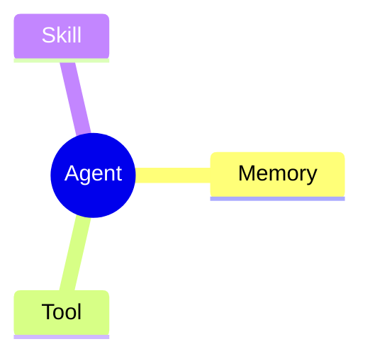

# KnowFlow 产品需求说明书

## 1. 项目概述

### 1.1 项目名称

正式候选名：KnowFlow

备选名：NoteFlow、MindFlow

产品标语：Turn notes into knowledge.

### 1.2 项目定位

KnowFlow 是一款 AI 驱动的 Obsidian 学习助手，用于辅助用户整理、学习和复习 Obsidian Vault 中的文章、剪藏和长期笔记。

插件的核心目标不是简单生成摘要，而是成为用户第二大脑里的学习引擎，把已经保存到 Obsidian 的资料转化为可理解、可测试、可复习的知识资产，形成如下闭环：

```text
文章 -> 整理 -> 总结 -> Quiz -> 学习状态 -> 复习 -> 知识检索
```

核心产品链路：

```text
Note -> Knowledge Point -> Learning -> Memory
```

### 1.3 产品边界

KnowFlow 作为独立 Obsidian 插件设计，不依赖既有 Hermes、Codex skills 或其他外部项目运行。

旧有 note-taking skills 中已经验证有效的文章清洗规则、学习材料格式、Quiz 格式和复习流程，可作为 KnowFlow 的需求来源和行为参考，但插件实现应内聚在自身代码库、配置和本地数据中。

### 1.4 目标用户

- 长期使用 Obsidian 管理技术文章、博客、PDF 摘要和个人笔记的用户
- 有大量 `Clippings/` 剪藏或 `Articles/` 文章积压，需要整理和筛选阅读价值的用户
- 希望把阅读变成学习流程，而不是只收藏资料的用户
- 需要围绕 AI、编程、系统设计、产品、研究资料等主题建立个人知识库的用户

## 2. 用户痛点

### 2.1 信息堆积

用户会持续保存微信公众号、掘金、少数派、InfoQ、GitHub、PDF 摘要和普通 Markdown 文档，但经常出现：

- 收藏后不阅读
- 阅读后不总结
- 总结后不复习
- 多篇文章之间无法形成主题体系

### 2.2 剪藏质量不稳定

Web Clipper 或网页导出内容常见问题包括：

- Frontmatter 字段混乱或缺失
- 标题层级被错误编号
- WeChat、掘金等平台注入广告、页脚、复制水印
- 代码块语言缺失或格式被压扁
- 图片路径存在多种变体，容易被误修复
- Markdown 表格、引用块、加粗标题不符合 Obsidian 渲染习惯

### 2.3 知识碎片化

用户可能保存了多篇关于 RAG、Agent、Embedding、Memory、Vector Database 的文章，但不知道它们之间的依赖关系、演进关系和应用边界。

### 2.4 学习缺少反馈

传统笔记流程通常停在阅读和摘录，缺少：

- 阅读价值判断
- 核心问题引导
- 理解检测
- 错题反馈
- 间隔复习
- 与历史笔记的主动关联

## 3. 产品目标

### 3.1 核心目标

打造 Obsidian 内的 AI 学习引擎，让 Vault 从资料仓库升级为个人学习系统。

### 3.2 阶段目标

- V0.1 Knowledge Pipeline：跑通当前文章整理、Frontmatter、AI 总结、Quiz 和学习状态
- V0.2 Learning System：加入 Mermaid 知识骨架、完整学习记录、Review Queue 和 Quiz 导入迁移
- V1.0 Intelligent Vault：加入知识关系、Learning Score、AI Search 和 Vault 问答

### 3.3 成功标准

插件上线后，用户应能完成以下流程：

1. 将一篇文章保存到指定目录
2. 插件自动格式化 Markdown
3. 插件生成规范 Frontmatter 和阅读价值评分
4. 插件生成结构化摘要
5. 插件生成 Quiz
6. 插件更新学习状态并给出下一步建议
7. 后续版本中，用户可把文章加入复习队列，并基于 Vault 内容提问获得来源明确的回答

## 4. 信息架构与默认目录

### 4.1 推荐 Vault 目录

```text
Clippings/             # Obsidian Web Clipper 保存的新文章入口
Articles/<分类>/        # 例如 人工智能、系统架构、编程语法
Archives/              # 导出文件、报告和历史 Markdown Quiz 兼容
Flashcards/            # 可选导出目录，不作为 Flashcard 默认存储
Templates/             # 用户可编辑模板
.knowflow/             # 插件内部数据，不直接面向用户
```

### 4.2 默认处理策略

- `Clippings/` 是资料入口，文章由 Obsidian Web Clipper 写入
- `Articles/` 是清洗并确认分类后的长期文章库
- KnowFlow 默认在 `Clippings/` 中格式化文章；移动到 `Articles/<分类>/` 需要用户确认实际分类后触发
- `Archives/` 仅用于导出、报告和兼容历史 Quiz Markdown，不作为新 Quiz 的默认事实来源
- `.knowflow/knowledge.db` 存放插件本地数据库
- 所有目录应允许用户在设置页中自定义

### 4.2.1 当前 Vault 兼容性

用户当前 Vault 已有以下结构，KnowFlow 应直接基于该结构工作：

```text
Clippings/             # 当前剪藏入口
Articles/              # 当前长期文章库，已按中文分类组织
Archives/              # 当前历史 Quiz Markdown
Archives/Daily-Quiz/   # 当前每日测验 Markdown
代办记事/复习队列.md    # 当前复习任务入口
Template/随机考试.md    # 当前基于 Markdown Quiz 的考试模板
```

当前 `Articles/` 已有较大规模分类文章库，典型分类包括：人工智能、知识积累、操作系统、常用工具、算法分析、系统架构、编程语法、项目管理等。

兼容策略：

- V0.1 默认在现有 `Clippings/` 和 `Articles/` 上工作
- 分类移动目标为 `Articles/<分类>/`
- 历史 `Archives/*_Quiz.md` 可通过导入器迁移到数据库
- `Template/随机考试.md` 这类基于 Markdown 的旧流程保留兼容，不作为新 Quiz 的主路径

### 4.3 内容分层

KnowFlow 必须明确隔离 AI 产物、用户笔记和原文，避免 AI 内容污染用户正文。V0.1 中，AI Summary、阅读价值、推荐动作和分类建议默认只存储在插件本地数据中，并在右侧边栏展示，不自动写入文章 Markdown。

推荐结构：

```markdown
---
metadata
---

> [!ai-summary]
> AI 总结、阅读价值和推荐动作

## 我的笔记

用户自己的理解、摘录和行动项。

## 原文

保留原始文章正文或清洗后的正文。
```

- AI 默认写入本地数据库或插件管理区块；V0.1 默认不写入 Markdown 正文
- 用户笔记区由用户拥有，插件不得自动覆盖
- 原文区默认保留，清洗动作完成后必须记录处理摘要
- 自动更新区块必须使用稳定 marker 或明确标题边界
- 用户主动执行「插入到文章」时，才允许把 AI Summary 写入 Markdown callout

### 4.4 推荐处理流

```text
Vault
  |
Clippings
  |
AI Summary / 阅读价值 / 分类建议
  |
整理 Markdown / Frontmatter
  |
用户确认分类移动
  |
Articles/<分类> ---- Archive
  |
Summary / Quiz / Review
  |
Knowledge Graph
```

## 5. 核心功能需求

### 5.1 Feature 1：AI 文章整理

#### 目标

整理当前文章，把网页剪藏或普通 Markdown 转换为适合 Obsidian 长期保存和学习的笔记。

#### 触发方式

- V0.1 仅支持用户主动触发，不自动监听目录
- 用户在命令面板中手动执行「KnowFlow: 整理当前文章」
- 用户在文件菜单中对选中文件执行整理
- V0.2 起可选支持监听 `Clippings/` 或用户配置的入口目录

#### 输入来源约定

V0.1 不做独立的站点来源识别。文章统一假设由 Obsidian Web Clipper 插件保存到当前 Vault 的 `Clippings/` 目录，或由用户手动打开当前 Markdown 后触发 KnowFlow。

插件只需要读取 Web Clipper 已经写入的文件内容和 metadata：

- 当前文件路径
- Frontmatter 中已有的标题、来源 URL、作者、创建时间等字段
- 正文内容
- 本地图片和附件引用

来源信息的用途仅限：

- 在侧边栏展示原文 URL 或来源名称
- 写入或补全 `source`
- 作为 AI 总结和阅读价值判断的辅助上下文

非目标：

- 不维护公众号、掘金、少数派、InfoQ 等站点识别列表
- 不基于平台类型选择复杂清洗分支
- 不尝试还原 Web Clipper 未保存的网页信息

#### Markdown 清理

插件应支持以下清理能力：

- 修复标题层级，避免 H2 直接跳到 H4/H5
- 将 Web Clipper 导出的粗体伪标题转换为 Markdown heading
- 清理 Web Clipper 常见页脚、广告、复制水印和无关导航文本
- 修复代码块语言、代码块闭合、代码缩进和不间断空格
- 修复表格分隔行、引用块和列表编号
- 保留正确的 Obsidian wikilink、embed、callout 和 Mermaid 语法
- 保守处理图片路径，优先保持 Web Clipper 已生成的本地引用，不做无差别替换

#### Frontmatter 生成

插件应以当前 Obsidian Vault 中 `Template/article.md` 为准生成或补全 Frontmatter。不要另起一套英文属性。

```yaml
---
创建日期: 2026-08-02
简要描述: "1 到 2 句文章概括"
阅读价值: 4
文章作者: "作者"
分类: 人工智能
tags:
  - "Agent"
  - "LLM"
网址: "来源 URL"
学习日期:
学习状态:
  - 未学习
状态: false
---
```

字段要求：

- `创建日期`：首次进入 Vault 日期，保留 Web Clipper 或模板原值
- `简要描述`：1 到 2 句文章概括
- `阅读价值`：1 到 5 的阅读价值
- `文章作者`：作者，未知时为空
- `分类`：目标 `Articles/<分类>/` 目录名
- `tags`：主题标签，使用 YAML 列表
- `网址`：来源 URL
- `学习日期`：date 类型属性；Clipping Pipeline 整理阶段默认置空，进入学习流程时再写入日期
- `学习状态`：使用模板中的 YAML 列表格式，例如 `- 未学习`
- `状态`：保留模板布尔字段；模板默认可为 `false`，Clipping Pipeline 整理完成后必须写为 `true`

数据库字段映射：

| Frontmatter 字段 | 数据库字段 |
|-|-|
| `创建日期` | `notes.created_at` |
| `简要描述` | `notes.description` 或 `note_summaries.core_points` 的短摘要 |
| `阅读价值` | `notes.reading_value` |
| `文章作者` | `notes.author` |
| `分类` | `notes.category` |
| `tags` | `notes.tags` |
| `网址` | `notes.source` |
| `学习日期` | `notes.learning_date` |
| `学习状态` | `notes.learning_status` |
| `状态` | 保留为兼容字段，不作为主状态来源 |

#### 阅读价值评估

```text
1 = 低价值、广告、严重过时或无实质内容
2 = 简单介绍、浅层资讯、工具列表
3 = 普通教程或有一定观点的分析
4 = 深入技术文章、可复现教程、系统性分析
5 = 长期参考资料、经典原理、可反复查阅的高价值内容
```

评估结果应包含一句简短理由，供用户判断是否精读。

#### 推荐动作

插件应基于阅读价值和内容类型给出明确的下一步建议：

- `skip`：不值得投入学习时间，建议归档或删除
- `skim`：快速阅读即可，不生成 Quiz
- `deep_learn`：值得精读，建议生成摘要和 Quiz
- `keep_reference`：适合作为长期参考，建议加入 `Articles/<分类>/`

推荐动作应在侧边栏展示。V0.1 默认允许插件在处理完成后更新 Frontmatter 的 `学习状态` 和数据库的 `notes.learning_status`；文件移动必须等待用户确认实际分类。

### 5.2 Feature 2：Clipping 整理与分类移动

#### 目标

将 `Clippings/` 中的 Web Clipper 文章整理为可学习笔记，并在用户确认实际分类后移动到 `Articles/<分类>/`。

V0.1 将“整理”和“移动”拆成两个动作：

- `整理当前文章`：只在当前 clipping 文件内清理正文、整理 Markdown 样式、补全 Frontmatter，并更新本地 Summary 数据
- `移动到分类`：用户确认实际分类后，才把文件移动到 `Articles/<分类>/`，并同步迁移数据库路径

整理逻辑：

- 读取并合并原始 Frontmatter，保留已有 `网址`、`文章作者`、`tags` 等字段
- 若设置中的 `Article template path` 存在，按模板 Frontmatter 字段顺序输出
- 更新 `简要描述`、`阅读价值`、`分类`、`学习日期`、`学习状态` 和 `状态`
- 清理 Web Clipper 常见残留文本、尾随空格、多余空行和过深标题层级
- 整理完成后刷新本地 Summary，并把 `分类与移动` 下拉默认值更新为最新建议分类

#### 交互入口

KnowFlow 右侧边栏根据当前打开 Note 的文件路径自动切换工作模式。

当用户打开 `Clippings/` 中的文章时，侧边栏默认进入 `Clipping` 页面。该页面只处理文章整理、AI Summary、分类移动和当前文章 Chat，不显示 Quiz 卡片，也不加载 Daily Learning。

打开 `Clippings/` 文章后，侧边栏默认先生成 AI Summary：

- 如果本地数据库中没有该文章摘要，自动触发一次 Summary 生成
- Summary 结果保存到本地数据库，不写入 Markdown 正文
- 已有 Summary 时直接读取，不重复生成
- Summary 卡片展示在 `Clipping Pipeline` 上方
- Summary 同时给出阅读价值、推荐动作和分类建议
- Summary 与 Frontmatter `简要描述` 必须分离：`简要描述` 是 1 到 2 句文章概括；侧边栏 AI Summary 必须使用结构化 Markdown，包含核心观点列表和章节梳理列表，不能与 `简要描述` 写成同一段话
- 侧边栏 AI Summary 若以 Markdown 返回，必须做轻量 Markdown 渲染，至少正确展示标题、粗体、有序列表和无序列表，而不是按纯文本显示 Markdown 符号
- Summary、阅读价值、推荐动作和分类建议必须调用用户配置的 `Summary model`，基于文章语义判断；不得使用标题关键词、文章长度或首段截取等本地伪 AI 规则替代
- 当 `Summary model` 未配置、禁用或调用失败时，显示失败状态和重试入口，不写入 Summary、阅读价值、推荐动作或分类建议
- Summary 卡片右侧提供无边框刷新按钮，用于重新生成 Summary 和分类建议；刷新执行中按钮必须有旋转动效，避免用户无法判断是否正在请求模型

#### Clipping 页面结构

`Clipping` 页面采用紧凑卡片结构，整体字体参考 Obsidian Copilot 插件，避免过大的数值和过重的字重。

```text
Header
KnowFlow / Clipping assistant

当前文章
标题
阅读价值 | 推荐动作 | 建议目录

AI Summary
结构化摘要
[刷新摘要]

Clipping Pipeline
状态：待整理 / 整理中 / 已整理 / 失败
默认只展示简短说明
[整理当前文章]

分类与移动
移动到 <分类下拉>
[移动到分类]

AI Composer
@ 当前文章 chip
输入问题 / 发送
```

顶部三个指标卡默认值均为 `--`，只有 Summary 或整理流程生成结果后才显示具体值：

- `阅读价值`：例如 `4/5`
- `推荐动作`：例如 `深入学习`、`快速阅读`、`可跳过`
- `建议目录`：例如 `人工智能`、`知识积累`

指标卡内部使用轻量分割线隔开 label 和 value，降低数值视觉重量。

#### Clipping Pipeline 展示规则

`Clipping Pipeline` 默认不展开全部处理步骤，避免用户在未执行时看到无意义的静态清单。

默认状态：

```text
Clipping Pipeline    待整理
点击整理后显示处理进度，整理完成后再选择是否移动到分类目录。

[整理当前文章]
```

点击 `整理当前文章` 后，Pipeline 卡片才逐项展示当前处理内容和实时状态：

```text
Clipping Pipeline    整理中

✓ 清理残留格式        完成
↻ 整理 Markdown 样式  进行中
○ 编辑章节结构        等待
○ LLM 整理正文格式    等待
○ 格式化代码块        等待
○ 转换公式            等待
○ 去除广告、二维码和页脚 等待
○ 补全 Frontmatter    等待
```

处理步骤顺序：

1. 清理残留格式
2. 整理 Markdown 样式
3. 编辑章节结构
4. LLM 整理正文格式
5. 格式化代码块
6. 转换公式
7. 去除广告、二维码和页脚
8. 补全 Frontmatter

`整理当前文章` 执行过程中按钮必须禁用并显示运行态；整理结束后允许再次点击，用于二次整理同一篇未完全整理好的文章。

V0.1 中，正文整理采用“本地确定性规则 + Summary model 格式整理”的组合：

- 清理 `\xa0`、多余空行、尾随空格、非代码区 tab、剪藏残留高亮 `==...==`
- 非代码区 `•` 转标准列表项 `-`，并规范列表缩进
- 修复 WeChat/网页剪藏导致的 `\*`、`\_`、`\[`、`\]`、`\.` 等非代码区多余转义
- 修复 `[==text==](url)`、URL 句号被吞入链接等明显 Markdown 链接损坏
- 将 `作者 | ...`、`审校 | ...`、`编译 | ...` 等顶部元数据行格式化为斜体，不作为标题
- 去除 `复制代码`、`体验AI代码助手`、`代码解读复制代码` 等常见代码块水印
- 规范 H1/H4+、标题中的多余粗体、自动编号和中文章节标题
- 正文不需要一级标题；Clipping Pipeline 不自动插入 `# 标题`，原文中的 H1 必须降级为 H2
- 识别常见代码块语言，修复 fenced code 的水印、转义反引号和明显挤压的长行
- 将明显由 Web Clipper 误转成 blockquote 的代码块恢复为 fenced code block，并清理代码中的粗体关键字
- 清理 Jupyter `In [N]:` / `Out[N]:` 标记
- 对连续 `1.` 有序列表做安全重编号
- 保留 Web Clipper 生成的图片路径，不做 URL decode 或路径重写
- 检测正文过短的 ghost clipping，失败返回，不写入半成品

LLM 正文格式整理必须遵守从既有 note-taking skills 迁移来的规则：不改写作者原意、不补充文章外知识、不重写图片路径、不凭空恢复缺失公式，只修复 Markdown 结构、代码块、标题层级和剪藏噪音。

KnowFlow 不能在 Obsidian 插件运行时直接调用 Codex/Hermes skills。旧 skills 是规则来源，必须迁移为插件内置 prompt、pipeline 规则和校验器。需要语义判断的摘要、阅读价值、推荐动作、建议目录和 tags 统一由 `Summary model` 生成。

处理完成后状态切换为 `已整理`；失败时状态切换为 `失败`，并在卡片内展示失败原因和重试入口。

整理状态必须按文章路径持久化保存。用户重新打开已整理的 `Clippings/` 文章时，`Clipping Pipeline` 应显示 `已整理` 和上次整理时间，而不是回到 `待整理`。文章移动或重命名时，整理状态必须随路径迁移。

#### 分类与移动

`分类与移动` 独立于整理动作。建议分类不一定正确，因此移动必须由用户确认。

展示规则：

- 不重复展示 `建议分类` 文本
- 直接展示 `移动到 <分类下拉>`
- 下拉默认值使用 AI Summary 给出的建议目录
- 用户可手动选择其他已有 `Articles/` 子目录
- 点击 `移动到分类` 后才执行文件移动

分类优先使用当前 Vault 已有 `Articles/` 子目录：

```text
人工智能
知识积累
操作系统
常用工具
算法分析
系统架构
编程语法
项目管理
工作相关
奇思妙想
论文相关
休闲时光
```

当分类不确定时，默认选择 `Articles/知识积累/` 或保留在 `Clippings/`，按用户设置决定。除非用户在设置中开启，不自动创建大量新分类。

#### 数据同步规则

KnowFlow 不在 Clipping 页面展示内部路径迁移串，例如 `Clippings/<title>.md -> Articles/<分类>/<title>.md`。这些信息对用户决策价值低，且长标题会挤占右侧栏空间。

但插件内部必须完整维护路径同步：

- `移动到分类` 执行后，更新数据库中的 `notes.path`
- 同步迁移旧路径下的 Summary、Quiz、Learning Record、Review Task 和 Pipeline Result
- 监听 Obsidian `rename` 事件，用户手动重命名或移动文章时，同步迁移数据库中该 Note 的相关状态
- Pipeline 自己移动文章后，也必须立即迁移旧路径下的本地数据，避免 Summary 留在 `Clippings/` 旧路径上

#### AI Composer

`Clipping` 页面底部保留 AI Composer。用户可直接向大模型询问当前剪藏内容，例如：

- 这篇文章适合放到哪个分类？
- 帮我判断阅读价值
- 这篇文章有没有值得深入学习的知识点？
- 格式化前后有哪些主要变化？

Composer 样式参考 Obsidian Copilot：

- 默认有细边框
- `@ 当前文章` chip 单行展示，长标题用省略号截断
- 图片按钮和发送按钮之间保留明确间距
- 发送按钮使用 icon + `chat` 文案

#### Pipeline Gate

KnowFlow 使用 `processing_status` 表示 Note 在处理流水线中的状态：

```text
raw -> cleaned -> processed -> ready
                  |
                failed
```

状态含义：

- `raw`：刚从 `Clippings/` 读取，尚未处理
- `cleaned`：Markdown 和 Frontmatter 已整理
- `processed`：AI 总结、阅读价值和分类建议已生成
- `ready`：已移动到 `Articles/<分类>/`，可进入学习流程
- `failed`：处理失败，需要在 Clipping Pipeline 区块内展示错误和重试入口

### 5.3 Feature 3：AI 知识总结

#### 目标

将文章转换为结构化知识，降低用户第一次理解成本。

#### 存储与展示

AI 总结默认不写入文章 Markdown 正文。

默认事实来源：

```text
.knowflow/knowledge.db
```

展示位置：

- KnowFlow 右侧边栏 `Knowledge` Tab
- 当前文章的摘要卡片
- 学习模式中的核心理解区

用户可主动执行「插入到文章」后，才将摘要写入 Markdown。

#### 数据结构

AI 总结应包含结构化字段，而不是只存一段纯文本：

- Frontmatter 简要描述：1 到 2 句概括，只用于文章属性
- 侧边栏结构化摘要：包含有序或无序列表，便于快速扫描
- 核心观点
- 章节梳理：说明文章各章节或主要部分分别讲了什么
- 关键概念
- 实践价值
- 局限与过时风险
- 关联知识
- 推荐动作
- 生成时间
- 使用模型

#### 可选 Markdown 插入格式

当用户主动选择插入文章时，写入用户指定位置，默认建议插入到「我的笔记」区，而不是原文区：

````markdown
> [!ai-summary] AI 总结
> **核心观点**：...
>
> **关键概念**：...
>
> **实践价值**：...
````

#### 要求

- 不改写原文正文含义
- 摘要应明确区分「文章观点」和「AI 推断」
- 技术文章应提取可执行实践、适用场景和边界条件
- 低价值文章应直接说明「建议跳过」或「仅扫读」
- 默认只更新数据库和侧边栏展示，不修改 Markdown 正文

### 5.4 Feature 4：知识骨架生成

Article Detail 页面应展示带 icon 的 `Knowledge Map` 卡片，用于将当前文章的概念结构生成 Mermaid，并插入原文的 `## Knowledge Map` 区块。V0.1 可先实现 Mermaid 生成与插入；知识点抽取和 Knowledge Point Detail 入口从 V0.2 开始实现。

#### 目标

使用 Mermaid 在原文中生成文章结构图，帮助用户理解主题结构、流程和知识关系。

#### 入口

知识骨架生成入口：

- `Article Detail -> Knowledge Map -> 生成 Mermaid`
- 命令面板：「KnowFlow: 生成当前文章知识骨架」

V0.2 中，知识点抽取应通过以下入口进入：

- `Article Detail -> Knowledge Map -> 查看知识点`
- 命令面板：「KnowFlow: 查看当前文章知识点」

当 V0.2 尚未启用知识点抽取时，`查看知识点` 按钮可置灰或显示为后续功能，但 `生成 Mermaid` 入口应保留。

#### 支持图形

- Mindmap：概念体系、分类结构
- Timeline：技术演进、历史发展
- Flowchart：工作流程、系统架构
- Sequence Diagram：调用流程、交互过程

#### 输出位置

直接插入当前文章 Markdown，不生成 Canvas，不生成额外文件。

默认区块：

````markdown
## Knowledge Map


````

#### 渲染约束

- Mermaid 节点文本应短，避免中文长句溢出
- Timeline 不适合长文本，首版应默认限制为 3 到 4 个阶段
- Flowchart 节点必须使用稳定 ID，避免因中文或空格导致引用失败
- 插件应提供重新生成、复制源码、删除知识骨架三个操作
- 如文章中已存在 `## Knowledge Map`，重新生成时只替换该区块

### 5.5 Feature 5：AI 学习助手

#### 目标

把单篇文章转为一次可执行的学习任务。

#### 学习模式面板

打开文章后，用户可进入学习模式，面板显示：

```text
学习状态
预计阅读时间
阅读价值
核心问题
关键概念
推荐动作：跳过 / 扫读 / 精读 / 出题 / 复习
```

#### 核心问题生成

插件应生成 3 到 7 个阅读前问题，例如：

- 这篇文章试图解决什么问题？
- 核心概念是什么？
- 它与我已有笔记中的哪些主题相关？
- 哪些结论今天可能已经过时？

#### 选区解释

用户选中文字后，可执行：

- 简单解释
- 技术解释
- 举例说明
- 翻译为中文
- 关联 Vault 中已有笔记

解释结果默认进入侧边栏，不自动写入正文。用户可选择插入为 callout。

### 5.6 Feature 6：数据库化 Quiz

#### 目标

检测用户是否真正理解文章，并把题目、选项、作答记录和掌握度作为结构化学习数据管理。

#### 生成入口

- 命令面板：「KnowFlow: 为当前文章生成 Quiz」
- 学习模式面板按钮：「生成练习题」
- 批量任务：「为本周学习文章生成 Quiz」

#### 存储策略

KnowFlow 引入 SQLite 后，Quiz 默认不再以 Markdown 文件作为主要存储。

默认事实来源：

```text
.knowflow/knowledge.db
```

数据库保存：

- question
- options
- correct answer
- explanation
- type
- difficulty
- source note
- user attempts
- correctness
- time cost
- mastery signal

Markdown 仅作为导出、分享、打印、Git 同步或迁移格式。

#### Quiz UI

用户不需要打开 Markdown 文件答题。文章侧边栏显示：

```text
Knowledge Panel

Agent Memory
学习状态：学习中

Quiz：12 题
正确率：75%

[生成试题]
[开始测试]
```

点击生成试题后写入数据库化 Quiz；点击开始测试后打开 KnowFlow Quiz View：

```text
问题 1 / 12

什么是 episodic memory？

○ A. ...
○ B. ...
○ C. ...
○ D. ...

[提交]
```

#### Markdown 导出

用户可通过命令或右键菜单导出 Quiz：

- 命令面板：「KnowFlow: 导出当前文章 Quiz」
- 文件菜单：「导出 Quiz 到 Markdown」

默认导出路径：

```text
Archives/exported/YYYY-MM-DD_Title_Quiz.md
```

报告类输出路径：

```text
Archives/reports/
```

导出文件仅是数据库快照，不作为后续答题记录的事实来源。

#### 历史 Markdown Quiz 导入

为兼容当前 Vault，插件应支持导入既有 Quiz Markdown：

```text
Archives/*_Quiz.md
Archives/Daily-Quiz/*.md
```

导入器应识别旧格式：

- `<!-- study-quiz:start -->`
- `<!-- study-quiz:end -->`
- `### X.Y. 题干`
- `- [ ] A. 选项`
- ` ```Answer fold`

导入后数据库成为事实来源，原 Markdown 保留不动。

#### 题型要求

- 核心概念
- 原理机制
- 对比分析
- 场景应用
- 易错点

#### 题量规则

- 阅读价值 1：0 到 4 题
- 阅读价值 2 到 3：4 到 8 题
- 阅读价值 4 到 5：8 到 12 题

#### 格式验收

- 数据库中的每道选择题必须包含题干、4 个选项、正确答案和解析
- 题目必须关联 `note_id`
- 用户每次提交必须写入 `quiz_attempts`
- Markdown 导出文件必须能独立阅读
- Markdown 导出不得反向覆盖数据库记录

### 5.7 Feature 7：复习系统

#### 目标

建立长期记忆，让高价值文章进入复习循环。

#### 数据存储

默认使用本地 SQLite：

```text
.knowflow/knowledge.db
```

#### 初始复习策略

首版支持简单间隔复习：

```text
第 1 次：学习后 1 天
第 2 次：学习后 3 天
第 3 次：学习后 7 天
第 4 次：学习后 14 天
第 5 次：学习后 30 天
```

后续版本支持 SM-2 和 FSRS。

#### 复习任务

复习任务应包含：

- 原文链接
- Quiz 链接
- 上次得分
- 下次复习日期
- 当前间隔
- 难度
- 用户反馈：简单、适中、困难、忘记

#### Obsidian 集成

插件应支持两种输出方式：

- 插件内部复习面板
- 写入指定 Markdown 文件，例如 `Archives/Review Queue.md`

### 5.8 Feature 8：知识关系图

#### 目标

自动从 Obsidian Notes 中抽取知识点，并发现知识点之间的关系。

KnowFlow 不构建泛化知识对象层。文章始终是 Obsidian Markdown Note，知识图谱的节点是 `knowledge_points`，Note 只是证据来源。

#### 关系类型

- `depends_on`：依赖
- `extends`：扩展
- `contrasts_with`：对比
- `implements`：实现
- `mentions`：提及
- `same_topic`：同主题

#### 示例

```text
Embedding -> Vector Database -> RAG -> Agent Memory -> Agent
```

#### 输出方式

- 写入 `knowledge_points`
- 写入 `note_knowledge_points`
- 写入 `knowledge_edges`
- 在插件侧边栏显示局部知识图

#### 知识点详情入口

V0.2 起提供 `Knowledge Point Detail` 页面，但不作为独立顶层导航。入口来自：

- `Article Detail -> Knowledge Map / 知识点入口 -> 查看知识点`
- `Daily Learning -> 薄弱知识点任务 -> 知识点详情`
- `Review -> 薄弱知识点任务 -> 知识点详情`

`Knowledge Point Detail` 页面应展示：

- 知识点名称、分类、描述
- 来源 Notes
- 关联 Quiz 和错题记录
- 掌握度与复习状态
- 相关 Knowledge Points
- 可返回来源文章或当前 Daily Learning / Review 任务

#### 要求

- 一篇 Note 可以关联多个 Knowledge Point
- 一个 Knowledge Point 可以来自多篇 Note
- Quiz 应优先关联具体 Knowledge Point
- Review 应能从薄弱 Knowledge Point 反查相关 Note
- V0.2 可先支持知识点抽取，V1.0 再支持完整知识点图谱

### 5.9 Feature 9：Daily Learning

#### 目标

基于 Obsidian Notes、复习记录和薄弱知识点，生成每日学习任务。

#### 每日任务组成

```text
今日学习

1 篇新文章
3 篇复习文章
2 个薄弱知识点
```

任务来源：

- `Clippings/` 中待处理的新文章
- `Articles/` 中高阅读价值但未学习的文章
- 到期的 `review_tasks`
- 错题率高或掌握度低的 `knowledge_points`

#### 任务类型

- `new_note`：学习一篇新 Note
- `review_note`：复习一篇已学 Note
- `weak_point`：复习一个薄弱 Knowledge Point

#### UI

Daily Learning 不作为独立页面存在。V0.1 中，`Articles Overview` 是除 Clipping 和 Article Detail 外的默认页面，并先提供 Daily Learning、学习进度、Clipping 统计和 Articles 分类统计。今日任务合并到 Daily Learning 卡片内部展示；V0.2 中接入真实 Daily Learning 调度，用于呈现今日学习概况和任务列表。

用户可执行：

- 开始今日学习任务
- 跳过任务
- 标记完成
- 重新生成今日任务

#### 版本范围

V0.2 开始实现完整任务生成。V0.1 只在 `Articles Overview` 中展示基础统计和任务占位，不生成持久化每日任务。

### 5.10 Feature 10：AI 知识搜索

#### 目标

基于 Vault 内容回答问题，并给出来源。

#### 示例

用户问题：

```text
我之前看过哪些关于 Agent Memory 的文章？
```

插件回答：

```text
找到 3 篇相关笔记：
1. xxx
2. xxx
3. xxx

共同观点：Memory 用于管理上下文，而不是简单存储。
差异点：其中一篇强调长期记忆，一篇强调工具调用上下文，一篇强调检索策略。
```

#### 要求

- 回答必须附来源笔记链接
- 默认围绕当前 Note 回答
- 用户可扩展范围到已学习 Notes 或 Knowledge Points
- 不做泛化的全世界知识助手
- 首版可先做当前 Note 和 metadata 检索，后续加入 embedding 索引
- 回答中涉及 Knowledge Point 时，应展示对应来源 Notes

## 6. 数据模型

### 6.0 存储边界

KnowFlow 的存储原则：

```text
Vault Markdown
================
用户创造和长期阅读的知识内容

SQLite
================
插件管理的系统状态和结构化学习数据
```

Markdown 负责：

- 原文
- 用户笔记
- 用户主动写下的总结、摘录、行动项
- 可迁移、可 Git 同步的长期知识内容

SQLite 负责：

- 学习状态
- AI 总结和推荐动作
- Quiz 题目和选项
- 用户答题记录
- Flashcard 调度状态
- 复习时间
- 知识关系
- AI 任务状态
- 成本和失败记录

原则：

- 唯一知识来源是 Obsidian Markdown Note
- `notes` 是核心实体，不引入 `knowledge_items` 抽象层
- Quiz 和 Flashcard 的默认事实来源是 SQLite
- AI 总结的默认事实来源是 SQLite
- Markdown Quiz 和 Markdown Flashcards 仅作为导出、迁移或兼容格式
- Markdown 中的 AI 总结仅作为用户主动插入的副本
- 数据库状态不得依赖重新解析 Markdown 才能恢复
- 可导出的内容必须能从数据库重新生成

核心关系：

```text
Obsidian Note
  |
notes
  |
  +-- note_summaries
  +-- quizzes
  +-- learning_records
  +-- review_tasks
  |
knowledge_points
  |
knowledge_edges
```

### 6.1 notes

```sql
CREATE TABLE notes (
  id TEXT PRIMARY KEY,
  path TEXT NOT NULL UNIQUE,
  title TEXT NOT NULL,
  description TEXT,
  note_type TEXT NOT NULL,
  source TEXT,
  author TEXT,
  category TEXT,
  tags TEXT,
  reading_value INTEGER,
  learning_status TEXT,
  learning_date TEXT,
  processing_status TEXT NOT NULL,
  last_ai_processed_at TEXT,
  created_at TEXT,
  updated_at TEXT
);
```

`note_type` 可选值：

- `article`
- `technical_note`
- `project_note`
- `summary`
- `daily_note`

`processing_status` 可选值：

- `raw`
- `cleaned`
- `processed`
- `ready`
- `failed`

### 6.2 learning_records

```sql
CREATE TABLE learning_records (
  id TEXT PRIMARY KEY,
  note_id TEXT NOT NULL,
  learned_at TEXT NOT NULL,
  duration_seconds INTEGER,
  quiz_score REAL,
  feedback TEXT,
  FOREIGN KEY (note_id) REFERENCES notes(id)
);
```

### 6.3 review_tasks

```sql
CREATE TABLE review_tasks (
  id TEXT PRIMARY KEY,
  note_id TEXT,
  knowledge_point_id TEXT,
  quiz_id TEXT,
  next_review_at TEXT NOT NULL,
  interval_days INTEGER NOT NULL,
  difficulty TEXT,
  status TEXT NOT NULL,
  created_at TEXT,
  updated_at TEXT,
  FOREIGN KEY (note_id) REFERENCES notes(id),
  FOREIGN KEY (knowledge_point_id) REFERENCES knowledge_points(id),
  FOREIGN KEY (quiz_id) REFERENCES quizzes(id)
);
```

### 6.4 note_summaries

AI 总结表。数据库是 AI 总结的默认事实来源。

```sql
CREATE TABLE note_summaries (
  id TEXT PRIMARY KEY,
  note_id TEXT NOT NULL,
  core_points TEXT,
  key_concepts TEXT,
  practical_value TEXT,
  limitations TEXT,
  related_knowledge TEXT,
  recommended_action TEXT,
  model TEXT,
  provider TEXT,
  created_at TEXT NOT NULL,
  updated_at TEXT,
  FOREIGN KEY (note_id) REFERENCES notes(id)
);
```

### 6.5 quizzes

Quiz 题目定义表。数据库是 Quiz 的唯一事实来源。

```sql
CREATE TABLE quizzes (
  id TEXT PRIMARY KEY,
  note_id TEXT NOT NULL,
  knowledge_point_id TEXT,
  question TEXT NOT NULL,
  type TEXT NOT NULL,
  difficulty INTEGER,
  explanation TEXT,
  created_at TEXT NOT NULL,
  updated_at TEXT,
  FOREIGN KEY (note_id) REFERENCES notes(id),
  FOREIGN KEY (knowledge_point_id) REFERENCES knowledge_points(id)
);
```

题型包括：

- `concept`
- `principle`
- `comparison`
- `scenario`
- `pitfall`

### 6.6 quiz_options

```sql
CREATE TABLE quiz_options (
  id TEXT PRIMARY KEY,
  quiz_id TEXT NOT NULL,
  option_key TEXT NOT NULL,
  content TEXT NOT NULL,
  is_correct INTEGER NOT NULL,
  sort_order INTEGER NOT NULL,
  FOREIGN KEY (quiz_id) REFERENCES quizzes(id)
);
```

### 6.7 quiz_attempts

```sql
CREATE TABLE quiz_attempts (
  id TEXT PRIMARY KEY,
  quiz_id TEXT NOT NULL,
  selected_option_key TEXT,
  answer TEXT,
  correct INTEGER NOT NULL,
  time_cost_seconds INTEGER,
  created_at TEXT NOT NULL,
  FOREIGN KEY (quiz_id) REFERENCES quizzes(id)
);
```

### 6.8 flashcards

Flashcard 与 Quiz 同理，默认数据库化。Markdown Flashcards 只作为可选导出或兼容格式。

```sql
CREATE TABLE flashcards (
  id TEXT PRIMARY KEY,
  note_id TEXT NOT NULL,
  front TEXT NOT NULL,
  back TEXT NOT NULL,
  difficulty INTEGER,
  next_review_at TEXT,
  created_at TEXT NOT NULL,
  updated_at TEXT,
  FOREIGN KEY (note_id) REFERENCES notes(id)
);
```

### 6.9 knowledge_points

知识点表。Note 是来源载体，Knowledge Point 是学习对象。

```sql
CREATE TABLE knowledge_points (
  id TEXT PRIMARY KEY,
  name TEXT NOT NULL,
  category TEXT,
  description TEXT,
  mastery_score REAL,
  created_at TEXT NOT NULL,
  updated_at TEXT
);
```

### 6.10 note_knowledge_points

Note 与知识点的关联表。一篇 Note 可包含多个知识点，一个知识点可来自多篇 Note。

```sql
CREATE TABLE note_knowledge_points (
  id TEXT PRIMARY KEY,
  note_id TEXT NOT NULL,
  knowledge_point_id TEXT NOT NULL,
  confidence REAL,
  evidence TEXT,
  created_at TEXT NOT NULL,
  FOREIGN KEY (note_id) REFERENCES notes(id),
  FOREIGN KEY (knowledge_point_id) REFERENCES knowledge_points(id)
);
```

### 6.11 knowledge_edges

```sql
CREATE TABLE knowledge_edges (
  id TEXT PRIMARY KEY,
  from_point_id TEXT NOT NULL,
  to_point_id TEXT NOT NULL,
  relation_type TEXT NOT NULL,
  confidence REAL,
  evidence TEXT,
  created_at TEXT,
  FOREIGN KEY (from_point_id) REFERENCES knowledge_points(id),
  FOREIGN KEY (to_point_id) REFERENCES knowledge_points(id)
);
```

### 6.12 daily_learning_tasks

每日学习任务表，用于组织新文章学习、复习文章和薄弱知识点。

```sql
CREATE TABLE daily_learning_tasks (
  id TEXT PRIMARY KEY,
  note_id TEXT,
  knowledge_point_id TEXT,
  task_type TEXT NOT NULL,
  task_date TEXT NOT NULL,
  status TEXT NOT NULL,
  created_at TEXT NOT NULL,
  updated_at TEXT,
  FOREIGN KEY (note_id) REFERENCES notes(id),
  FOREIGN KEY (knowledge_point_id) REFERENCES knowledge_points(id)
);
```

`task_type` 可选值：

- `new_note`
- `review_note`
- `weak_point`

`status` 可选值：

- `pending`
- `done`
- `skipped`

### 6.13 ai_tasks

AI 任务表用于支持任务队列、失败重试、成本统计和后续批量处理。

```sql
CREATE TABLE ai_tasks (
  id TEXT PRIMARY KEY,
  type TEXT NOT NULL,
  status TEXT NOT NULL,
  note_id TEXT,
  input_hash TEXT,
  input_tokens INTEGER,
  output_tokens INTEGER,
  model TEXT,
  provider TEXT,
  error TEXT,
  created_at TEXT NOT NULL,
  started_at TEXT,
  finished_at TEXT,
  FOREIGN KEY (note_id) REFERENCES notes(id)
);
```

任务类型首版包括：

- `clean_article`
- `generate_summary`
- `generate_quiz`
- `classify_note`
- `recommend_action`
- `extract_knowledge_points`
- `generate_daily_learning`

任务状态包括：

- `pending`
- `running`
- `succeeded`
- `failed`
- `cancelled`

### 6.14 learning_scores

Learning Score 用于 V1.0 的知识成长指标。V0.1 不实现，但数据模型应提前保留扩展空间。

```sql
CREATE TABLE learning_scores (
  id TEXT PRIMARY KEY,
  category TEXT NOT NULL,
  notes_read INTEGER NOT NULL,
  notes_mastered INTEGER NOT NULL,
  quiz_average REAL,
  review_completion_rate REAL,
  updated_at TEXT NOT NULL
);
```

示例展示：

```text
AI
阅读：120 篇
掌握：45 篇

系统设计
阅读：30 篇
掌握：18 篇
```

## 7. 技术架构

### 7.1 技术栈

- Obsidian Plugin API
- TypeScript
- React 或 Preact
- SQLite，优先使用适配 Obsidian 桌面端的本地存储方案
- AI Runtime 抽象层，支持 Cloud OpenAI-compatible endpoint、Ollama 和 LM Studio

### 7.2 推荐项目结构

```text
knowflow/
├── manifest.json
├── package.json
├── src/
│   ├── main.ts
│   ├── settings/
│   │   ├── SettingsTab.ts
│   │   └── schema.ts
│   ├── ui/
│   │   ├── RightSidebarView.tsx
│   │   ├── ClippingMode.tsx
│   │   ├── ArticlesOverview.tsx
│   │   ├── ArticleDetail.tsx
│   │   ├── QuizView.tsx
│   │   ├── ReviewPanel.tsx
│   │   ├── Composer.tsx
│   │   └── ChatResultView.tsx
│   ├── ai/
│   │   ├── client.ts
│   │   ├── providers/
│   │   └── prompts/
│   ├── article/
│   │   ├── markdownCleaner.ts
│   │   ├── frontmatter.ts
│   │   └── categoryMover.ts
│   ├── knowledge/
│   │   ├── summarizer.ts
│   │   ├── mapGenerator.ts
│   │   └── linker.ts
│   ├── learning/
│   │   ├── quizGenerator.ts
│   │   ├── quizImporter.ts
│   │   ├── quizExporter.ts
│   │   ├── reviewScheduler.ts
│   │   └── learningState.ts
│   └── database/
│       ├── sqlite.ts
│       └── migrations/
└── docs/
```

### 7.3 AI Pipeline 机制

插件内部能力模块化，但不使用 `skills` 命名，避免和外部 Agent Skill 系统混淆。统一使用 `pipelines` 表达插件内部处理流水线。

```text
src/ai/pipelines/
├── article-cleaner/
│   ├── pipeline.yaml
│   ├── prompt.md
│   └── handler.ts
├── summarize/
├── outline-generator/
├── quiz-generator/
└── knowledge-linker/
```

每个 pipeline 至少定义：

- 输入类型
- 输出类型
- Prompt 模板
- 结果校验器
- 是否允许写入 Vault
- 是否支持处理前确认
- 是否记录处理摘要
- 是否允许批量执行

V0.1 的 Clipping Pipeline 分成两类能力：

- 本地确定性整理：清理 Web Clipper 残留格式、整理 Markdown 样式、编辑章节结构、格式化代码块、转换公式、去除广告二维码和页脚
- LLM 语义判断：AI Summary、阅读价值、推荐动作、建议目录和 tags，必须调用 `Summary model`

插件可以内置从既有 note-taking skills 验证过的规则迁移而来的 Prompt 和 Markdown 处理规则，但 KnowFlow 作为独立 Obsidian 插件，不在运行时依赖外部 Skill 系统。

## 8. UI 需求

### 8.1 右侧边栏优先

KnowFlow 的主界面默认以 Obsidian 右侧边栏形式呈现，而不是独立全屏页面。

设计原则：

- 跟随当前打开的笔记变化
- 不打断用户在主编辑区阅读和写作
- 主要操作在侧边栏完成
- 需要专注答题或 Review 时，从当前卡片按钮进入 Quiz View 或 Review View
- V0.1 不使用顶部 Tab 导航；页面由当前 Obsidian 上下文自动路由

默认入口：

- Obsidian 右侧 ribbon icon
- 命令面板：「KnowFlow: 打开侧边栏」
- 打开文章后可自动激活，但默认不抢焦点

### 8.2 侧边栏布局

侧边栏采用三段式布局：

```text
Header
  当前视图标题 / 当前笔记或范围 / 索引状态 / 帮助入口

Content
  根据当前上下文展示 Clipping Pipeline、Articles Overview 或 Article Detail

Composer
  仅在需要大模型对话的页面显示 AI 输入框、上下文 chip、模型选择、发送按钮
```

### 8.3 上下文路由

KnowFlow 应根据当前打开文章的路径判断默认页面，而不是始终显示同一套卡片。

路径规则：

| 当前上下文 | 默认页面 | 页面目标 |
| --- | --- | --- |
| `Clippings/**` | `Clipping` | 整理剪藏文章，生成 Frontmatter、阅读价值、AI Summary 和分类移动 |
| 选中 `Articles/` 或其子文件夹 | `Articles Overview` | 展示该范围内的 Daily Learning 总览、学习进度、待学文章和复习任务 |
| 打开 `Articles/**/*.md` 具体文章 | `Article Detail` | 学习当前文章，展示阅读价值、AI Summary、Quiz、Review 状态和 Chat |
| 其他 Markdown 文件或无匹配上下文 | `Articles Overview` | 默认展示全局学习总览，不显示 Chat |

`Clipping` 页面内容：

- 当前文章标题
- 阅读价值、推荐动作、建议目录三个指标
- AI Summary，位于 Clipping Pipeline 上方
- Clipping Pipeline，默认折叠步骤，点击整理后展示实时进度
- 分类与移动，下拉默认使用建议目录，用户可手动选择
- 整理结果或失败原因
- AI Composer

`Clipping` 页面不显示：

- Quiz 卡片
- Daily Learning
- Review Queue
- Knowledge Graph

`Articles Overview` 页面内容：

按以下顺序展示：

1. Daily Learning：新文章、复习、薄弱点，以及学习、复习、薄弱点任务占位
2. 学习进度：本周阅读、本周复习、平均正确率
3. Clipping 统计：当前 `Clippings/` 中待整理文章数、已摘要数、高价值数
4. Articles 分类统计：当前 Article 分类文章总数、已学习数、待读数，以及各分类行

当用户选中 `Articles/` 或其子文件夹时，Articles 分类统计以该范围为主；当用户点击 Obsidian 中除 `Clippings/` 与 `Articles/` 具体文章外的任何文件时，默认展示全局 `Articles Overview`。

主页统计数据源：

- `Clipping 统计` 直接扫描 `Clippings/` 下的 Markdown 文件，并结合本地 Summary 判断已摘要和高价值数量
- `Articles 分类统计` 直接扫描 `Articles/<分类>/` 下的 Markdown 文件
- `已学习` 优先读取文章 Frontmatter 中的 `学习状态`，缺失时回退到插件本地 store
- `本周阅读` 优先读取 Frontmatter 中的 `学习日期`
- `Daily Learning` 的新文章和复习数量受设置页 `dailyNewArticleLimit` 和 `dailyReviewLimit` 限制

`Articles Overview` 页面不显示：

- 单篇文章 AI Summary
- 单篇文章 Quiz 卡片
- 单篇文章 Mermaid 插入
- AI Composer

`Article Detail` 页面内容：

- 当前文章学习状态
- 阅读价值
- AI Summary
- Knowledge Map / Mermaid 生成卡片，位于 AI Summary 和 Quiz 之间
- Quiz 卡片
- Review 状态
- AI Composer

Article Detail 指标读取规则：

- `阅读价值` 直接读取当前 Articles 文章 Frontmatter 中的 `阅读价值`
- `状态` 直接读取当前 Articles 文章 Frontmatter 中的 `学习状态`
- 如果 Frontmatter 尚未解析或字段缺失，才回退到插件本地 store 或显示 `--`
- 不在标题下展示完整文件路径

Article Detail 中 `AI Summary`、`Knowledge Map` 和 `Quiz` 卡片标题前都应显示 icon，保持和 Clipping 页面卡片抬头一致。

AI Composer 仅在 `Clipping` 和 `Article Detail` 页面保留。`Articles Overview` 是文件夹级学习仪表盘，不提供 LLM Chat 输入框。

### 8.4 Header

Header 应显示：

- 当前页面名称，例如 `Clipping`、`Articles`、`Article Detail`、`Quiz`、`Review`
- 当前索引状态，例如 `Build Index`、`Indexing`、`Ready`
- 必要的返回入口，主要用于 `Chat Result View` 或二级页面
- Clipping 页面 Header 只显示 KnowFlow 品牌和 `Clipping assistant`，不放设置按钮或刷新按钮
- AI Summary 刷新按钮放在 Summary 卡片内，使用无边框 icon button

V0.1 中，索引功能未完成时，`Build Index` 入口可以存在但置灰或显示为后续功能。

### 8.5 Content 区

Content 区根据当前 Obsidian 上下文展示对应页面，不提供顶部 Tab 导航：

- `Clipping`：当前文章、AI Summary、阅读价值、推荐动作、建议目录、Clipping Pipeline、分类移动
- `Articles Overview`：Daily Learning 总览、学习进度、今日任务
- `Article Detail`：当前文章阅读价值、AI Summary、Knowledge Map / Mermaid、Quiz 卡片、Review 状态
- `Quiz View`：从 Article Detail 的 Quiz 卡片进入，显示题目、提交答案、结果反馈
- `Review View`：V0.2 起可从 Articles Overview 的复习任务进入，显示今日复习和薄弱知识点

V0.1 默认页面由当前 Obsidian 上下文决定：`Clippings/**` 打开 `Clipping`；选中 `Articles/` 或子文件夹打开 `Articles Overview`；打开 `Articles/**/*.md` 具体文章打开 `Article Detail`。当用户在 `Article Detail` 点击「生成试题」后生成数据库化 Quiz；点击「开始测试」后进入 `Quiz View`。

### 8.6 Composer

侧边栏底部提供 AI 输入框，支持基于当前笔记提问。

Composer 应包含：

- 当前上下文 chip，例如 `Current: 当前笔记标题`
- `@` 添加上下文入口
- `/` 自定义 prompt 入口
- 模型选择
- 发送按钮
- 附件或图片入口，后续版本

示例占位文案：

```text
Ask KnowFlow about this note · @ to add context · / for prompts
```

V0.1 中，Composer 至少支持围绕当前 Note 提问和生成学习产物。V0.2 起可扩展到已学习 Notes 和 Knowledge Points，跨 Vault embedding 检索到 V1.0 实现。

视觉规则：

- Composer 默认有边框，整体参考 Obsidian Copilot 的紧凑输入框
- 当前上下文 chip 单行展示，长标题用省略号截断
- 图片按钮和发送按钮之间留出明确间距
- 发送按钮使用 icon + `chat` 文案，避免纯文字按钮显得突兀
- `Articles Overview` 不显示 Composer

### 8.7 Chat Result View

用户在 `Clipping` 或 `Article Detail` 的 Composer 输入问题并发送后，右侧边栏应进入 `Chat Result View`，而不是把长回答塞回原页面卡片中。

进入方式：

- `Clipping -> Composer -> Send`
- `Article Detail -> Composer -> Send`

`Chat Result View` 应包含：

- Header：结果页标题、返回当前上下文、当前索引状态
- User Question Card：用户问题、当前上下文 chip、时间、复制/编辑/删除
- Thinking 状态：模型思考或检索状态，可折叠
- Answer Content：模型回答正文，支持 Markdown、列表、代码块、重点高亮
- Action Bar：复制、重新生成、保存为摘要、生成 Quiz、插入到我的笔记
- Composer：继续追问，沿用当前上下文

AI 响应必须区分：

- 临时回答
- 可保存为文章 AI 总结的内容
- 可转换为 Quiz 的内容
- 可作为用户笔记插入的内容

操作包括：

- 保存为 AI 总结
- 插入到我的笔记
- 生成 Quiz
- 复制
- 重新生成
- 删除

任何写入主笔记的动作都必须进入处理摘要，并支持可选的处理前确认。

### 8.8 Dashboard

Dashboard 显示用户当前学习状态，作为侧边栏中的统计视图或后续独立视图：

```text
今日学习
3 篇待学习

待复习
5 篇

知识增长
AI          ████████
系统设计    █████
编程语言    ███
```

应包含：

- Clippings 待处理文章数量
- 今日学习任务
- 学习中文章
- 今日复习任务
- 薄弱知识点
- 最近生成 Quiz
- Quiz 正确率
- 最近错题最多的知识点
- 高价值未读文章
- 推荐跳过文章
- Learning Score，V1.0
- 最近知识关系

### 8.9 文章侧边栏

打开文章时，侧边栏显示：

- 来源信息，来自 Web Clipper metadata 或当前文件
- 阅读价值
- 推荐动作
- 学习状态
- 最近处理摘要
- AI Summary
- Quiz 生成状态
- Quiz 题数和正确率
- 关联知识点
- 关联笔记
- 操作按钮：整理、总结、生成知识图、生成试题、开始测试、加入复习

### 8.10 Obsidian 插件设置页

KnowFlow 设置必须放在 Obsidian 原生 `设置 -> 第三方插件 -> KnowFlow` 页面中，不作为右侧边栏的业务页面。

右侧边栏只承载当前工作流：

- Clipping Mode
- Articles Overview
- Article Detail
- Quiz Test
- Chat Result
- Knowledge Points，V0.2+

插件设置页采用 Obsidian 原生设置页面，并按 tab 分组：

- Basic：基础路径、模板和默认分类，不包含 AI 模型配置
- AI Models：Summary / Chat / Quiz 三个模型入口
- Pipeline：Clipping 文章处理流水线
- Learning：每日学习、复习和学习评分规则
- Data：本地数据、导出、清理和隐私

每个 tab 内部可使用可展开/收起的配置卡片，降低 Obsidian 设置页中的信息密度。

#### Basic

Basic 只包含插件基础运行配置：

- Clipping folder
- Articles folder
- Archive folder
- Article template path
- 默认分类
- 是否允许自动创建分类目录
- 路径校验按钮：检查 Clipping folder、Articles folder、Archive folder 和 Article template 是否存在

Basic 不包含：

- Summary model
- Chat model
- Quiz model
- API Key
- AI Runtime
- Pipeline 自动化开关

#### AI 模型

`AI 模型` 卡片外层只显示三个模型配置入口：

- Summary model
- Chat model
- Quiz model

每个入口点击后打开独立配置弹窗。

#### 模型配置弹窗

每个模型配置弹窗必须包含：

- AI Runtime：Cloud / Ollama / LM Studio / Disabled
- Cloud 使用 OpenAI-compatible 模式，不单独区分 OpenAI、DeepSeek 等 provider
- Base URL：
  - Cloud：OpenAI-compatible endpoint
  - Ollama：默认 `http://localhost:11434/v1`
  - LM Studio：默认 `http://localhost:1234/v1`
- API Key：
  - Cloud：本地保存，输入框默认 password 类型
  - Ollama / LM Studio：可为空
- Model ID：当前任务使用的具体模型名
- 连接测试按钮
- Token / cost 提示，V0.2+

说明：

- Summary model、Chat model、Quiz model 互相独立，各自拥有 AI Runtime、Base URL、API Key 和 Model ID。
- Cloud 只支持 OpenAI-compatible API 形态，具体厂商通过 Base URL 和 API Key 区分。
- 是否使用云端 AI 由 AI Runtime 表达：选择 `Disabled` 表示不使用 AI；选择 `Ollama` 或 `LM Studio` 表示本地模型。
- 不设置全局 Default Model，也不单独设置 Cloud AI 开关，避免和三个任务模型配置重复。

#### Pipeline

- 自动整理开关，默认关闭，V0.2+
- 自动生成摘要开关，默认关闭，V0.2+
- 自动生成 Quiz 开关，默认关闭，V0.2+
- 失败重试次数，V0.2+
- Mermaid skeleton：生成后插入原文，不生成 Canvas 或额外文件
- Quiz export：Quiz 默认存数据库，仅按需导出 Markdown

#### Learning

- 每日新文章数量
- 每日复习数量
- 每日薄弱知识点数量，V0.2+
- Quiz 难度默认值
- 复习算法，V0.2+
- Learning Score 规则，V1.0

#### Prompts & Rules

- 自定义 Prompt
- 自定义分类规则
- 自定义标签规则

#### Data & Privacy

- 数据存储位置
- 导出数据
- 清理 AI task 历史
- AI 请求前展示发送内容范围

V0.1 已实现：

- 导出当前插件 settings 和本地 store 为 JSON
- AI task 历史清理按钮保留为禁用状态，等待 `ai_tasks` 表实现

说明：

- 这些配置使用 Obsidian `PluginSettingTab` 实现。
- 不在 KnowFlow 右侧栏中提供 Settings 页面。
- 是否使用云端 AI 由每个模型配置中的 `AI Runtime` 决定，不再提供全局 Cloud AI 开关。
- 右侧栏可保留一个“打开插件设置”的轻量入口，点击后跳转到 Obsidian 插件设置页；V0.2+ 再考虑。

### 8.11 原型图清单

原型源文件：

```text
docs/design.pen
```

当前保留页面：

| 原型页面 | 入口 | 说明 |
| --- | --- | --- |
| `KnowFlow Sidebar - Clipping Mode` | 打开 `Clippings/**/*.md` | 当前剪藏文章整理、AI Summary、Pipeline、分类移动和 Chat |
| `KnowFlow Sidebar - Articles Overview` | 选中 `Articles/` 或其子文件夹 | 文件夹级学习总览、Daily Learning、进度和任务，不显示 Chat |
| `KnowFlow Sidebar - Article Detail Mode` | 打开 `Articles/**/*.md` | 当前文章 Summary、Knowledge Map / Mermaid、Quiz、Review 状态和 Chat |
| `KnowFlow Sidebar - Chat Result View` | 在 Clipping 或 Article Detail 中发送 Chat | 独立展示问题、思考状态、回答和后续操作 |
| `KnowFlow Sidebar - Quiz Test` | Article Detail -> Quiz -> 开始测试 | 数据库化 Quiz 的答题界面 |
| `KnowFlow Sidebar - Knowledge Points` | V0.2，从 Knowledge Map 或薄弱知识点任务进入 | 知识点详情，不作为顶层导航 |
| `KnowFlow Modal - Model Config` | Obsidian 设置页 AI Models -> 任一模型 Configure | Summary / Chat / Quiz 独立模型配置弹窗 |
| `Obsidian Settings - KnowFlow / Basic` | Obsidian 插件设置 | 基础路径、模板和分类 |
| `Obsidian Settings - KnowFlow / AI Models` | Obsidian 插件设置 | Summary / Chat / Quiz 三个模型入口 |
| `Obsidian Settings - KnowFlow / Pipeline` | Obsidian 插件设置 | Clipping pipeline 和导出相关设置 |
| `Obsidian Settings - KnowFlow / Learning` | Obsidian 插件设置 | Daily Learning、Review 和学习规则 |
| `Obsidian Settings - KnowFlow / Data` | Obsidian 插件设置 | 本地数据、导出、清理和隐私 |

原型维护规则：

- 不保留无入口页面，例如独立 Activity 页面或独立 Daily Learning 页面
- 不使用顶部业务 Tab，页面由 Obsidian 当前上下文自动切换
- 不在右侧栏放完整 Settings 页面，设置统一放到 Obsidian 插件设置中
- Clipping 页面不展示内部路径迁移串，不展示静态完整 pipeline 步骤清单
- 一屏内容完整放下时，不应出现右侧滚动条；内容超出时再滚动

## 9. 非功能需求

### 9.1 性能

- 不阻塞 Obsidian 主线程
- AI 任务必须异步执行
- 大文件处理应显示进度
- 批量处理应支持暂停、继续和失败重试
- 默认避免在用户编辑时自动覆盖当前文件

### 9.2 数据安全

- 用户 Vault 内容默认只存本地
- API Key 只保存在本地 Obsidian 插件配置中
- 用户可关闭云端 AI，仅使用本地模型或纯本地规则
- AI 请求前应明确展示将发送的内容范围
- 插件不得默认上传整个 Vault

### 9.3 可扩展性

- 支持自定义 Prompt
- 支持自定义来源清洗规则
- 支持自定义标签和分类映射
- 支持新增 AI Provider
- 支持后续接入 embedding 索引

### 9.4 稳定性

- 所有自动写入必须可撤销
- 自动更新区块必须使用稳定 marker，避免覆盖用户正文
- 对 Frontmatter、Quiz、Mermaid 输出提供格式校验
- 失败时保留原文，不写入半成品
- V0.1 默认不要求处理前确认，但必须记录处理摘要
- 文件移动必须更新数据库路径，并保留原路径记录用于回退
- 原始内容、AI 产物和用户笔记必须隔离

## 10. 版本范围

### 10.1 V0.1 Knowledge Pipeline

目标：验证用户是否愿意通过 KnowFlow 把单篇文章转化为一次学习流程。

核心流程：

```text
Clippings/当前文章 -> AI Summary/阅读价值/建议目录 -> 整理正文/Frontmatter -> 用户确认移动 -> Articles/文章学习 -> Quiz -> 学习状态
```

V0.1 必做：

- 手动整理当前文章
- 读取 Web Clipper metadata
- Markdown 轻量清理
- Frontmatter 生成和更新
- 阅读价值评分
- 推荐动作：跳过、扫读、深入学习、长期参考
- AI 总结
- Quiz 生成，默认写入 SQLite
- Quiz View 答题
- Quiz attempt 记录
- Quiz Markdown 导出
- 学习状态更新
- 用户确认后按分类移动到 `Articles/<分类>/`
- Mermaid 知识骨架生成，插入当前文章 `## Knowledge Map`
- 处理完成摘要
- 右侧边栏主界面
- 当前笔记上下文 Composer
- 基础设置页

V0.1 暂不做：

- 自动监听目录
- 完整学习记录分析
- Review Queue
- Knowledge Point 抽取
- Daily Learning
- 知识图谱
- AI Search
- Vault 问答
- 批量处理
- 历史 Markdown Quiz 批量导入
- 移动端完整支持

### 10.2 V0.2 Learning System

目标：在单篇学习流程稳定后，加入复习和可视化学习辅助。

加入：

- 完整 SQLite 本地数据库
- `ai_tasks` 任务记录
- Knowledge Point 抽取
- Note 与 Knowledge Point 关联
- Knowledge Point Detail 页面
- `Article Detail -> Knowledge Map / 知识点入口 -> 查看知识点`
- `Daily Learning / Review -> 薄弱知识点任务 -> 知识点详情`
- Daily Learning
- 学习记录
- Review Queue
- Review Panel
- Quiz 得分记录
- 历史 Markdown Quiz 导入器
- 简单间隔复习
- Flashcards 导出
- 可选监听 `Clippings/` 或用户配置的入口目录

### 10.3 V1.0 Intelligent Vault

目标：把单篇学习流程扩展为 Vault 级知识系统。

加入：

- 知识关系图
- Knowledge Point 图谱
- AI Search
- Vault 问答
- Embedding 索引
- 跨文档主题聚类
- Learning Score
- SM-2 或 FSRS

### 10.4 长期暂不做

- 多用户协作
- 云端同步服务
- 自动重构整个 Vault 分类体系
- 无确认的大规模批量改写
- 面向所有 Obsidian 社区插件的完整兼容承诺

## 11. 验收标准

### 11.1 文章整理验收

- KnowFlow 可在 Obsidian 右侧边栏打开
- 侧边栏能识别当前活动笔记
- 当前文章可被插件读取并解析为 Web Clipper Markdown
- Frontmatter 为合法 YAML
- 标题层级无明显跳级
- 代码块 fence 成对闭合
- Web Clipper 常见水印和无关页脚被清除
- 图片路径未被错误改写
- Obsidian 中预览无明显渲染错误
- 处理完成后展示整理摘要
- 用户确认分类后，文章被移动到对应 `Articles/<分类>/`
- 移动后数据库中的 `notes.path` 正确更新
- 用户手动重命名或移动文章后，summary、quizStats、learning 状态不会丢失
- `note_type`、`processing_status`、`last_ai_processed_at` 正确写入或更新
- 低价值文章能给出明确跳过建议

### 11.2 总结验收

- 新生成 AI 总结默认写入 `note_summaries`
- 包含核心观点、关键概念、实践价值、局限与关联知识
- 低价值文章能明确提示跳过或扫读
- 生成内容不覆盖原文
- 右侧边栏能展示当前文章的 AI 总结
- 用户主动选择后，才可将摘要插入 Markdown

### 11.3 知识骨架验收

- 生成 `## Knowledge Map`
- `## Knowledge Map` 直接插入当前文章 Markdown
- 不生成 Canvas 或额外文件
- Mermaid 语法可在 Obsidian 渲染
- 图形类型与文章结构匹配
- 长文本不会造成严重溢出

### 11.4 Quiz 验收

- 新生成 Quiz 默认写入 SQLite
- 每题包含题干、4 个选项、正确答案、解析、题型和难度
- 每题关联来源 `note_id`
- V0.2 起，题目应尽量关联 `knowledge_point_id`
- 用户提交答案后写入 `quiz_attempts`
- Quiz View 能在右侧边栏内显示题目、提交答案、展示结果
- Markdown 导出写入 `Archives/exported/`
- 导出 Markdown 可独立阅读，但不作为事实来源
- 导入历史 Markdown Quiz 后，原文件保持不变

### 11.5 复习验收

V0.2 起验收。

- 学习完成后生成复习任务
- 下次复习日期正确
- 用户反馈会更新后续间隔
- Dashboard 能显示待复习数量
- Review 任务可关联 Note 或 Knowledge Point

### 11.6 Knowledge Point 验收

V0.2 起验收。

- 能从 Note 中抽取候选 Knowledge Point
- 能建立 `note_knowledge_points` 关联
- Quiz 可关联具体 `knowledge_point_id`
- 薄弱 Knowledge Point 能反查来源 Notes
- Knowledge Graph 连接 Knowledge Point，而不是默认连接 Note

### 11.7 Daily Learning 验收

V0.2 起验收。

- 能生成每日学习任务
- 任务来源包括新文章、复习文章和薄弱知识点
- 用户可标记完成、跳过或重新生成任务
- 任务状态写入 `daily_learning_tasks`

### 11.8 Pipeline 验收

- 每个 pipeline 有明确输入、输出、校验器和写入权限
- 写文件的 pipeline 必须记录处理摘要
- 移动文件的 pipeline 必须记录原路径和目标路径
- AI 任务失败时能记录错误信息
- 重试不会重复写入同一插件区块

## 12. 风险与待决策

### 12.1 SQLite 兼容性

Obsidian 插件在不同平台对原生 SQLite 的支持存在差异。需要在技术设计阶段确认：

- 桌面端是否使用 SQLite WASM、sql.js 或本地 adapter
- 移动端是否降级为 JSON 存储
- 数据库迁移方案

### 12.2 AI 成本与隐私

长文章摘要、Quiz 和 Vault 搜索可能产生较高 token 成本。需要提供：

- 请求前预估
- 最大输入长度
- 分块策略
- 本地模型选项
- 用户确认机制

### 12.3 自动写入风险

自动清洗 Markdown 可能误判正文结构。需要提供：

- 可选的处理前确认
- 处理完成摘要
- 只处理插件区块
- 失败回滚
- 可关闭自动整理
- 文件移动回退路径
- 用户笔记区不得被 pipeline 覆盖

### 12.4 与 Obsidian 社区插件兼容

需要重点验证：

- Number Headings
- Dataview
- Tasks
- Spaced Repetition
- Templater
- Web Clipper

## 13. 后续文档拆分建议

本 PRD 确认后，建议继续拆分：

- `docs/technical-design.md`
- `docs/database-schema.md`
- `docs/ai-pipeline-design.md`
- `docs/development-roadmap.md`
- `docs/mvp-acceptance-checklist.md`
